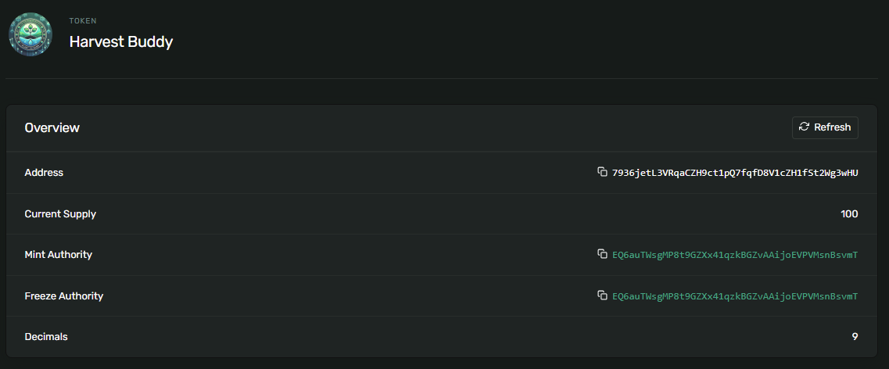

# 🌱 HarvestBuddy Project

Welcome to the HarvestBuddy project! This platform is designed to help you grow your investments effortlessly, just like watering a plant. Here's a quick overview of what HarvestBuddy offers:

## 🌿 Demo Site
Harvert Buddy https://harvestbuddy.site/
X: https://x.com/harvestbuddy1

## 🌿 Real Growth
Plant and watch your investments bloom!

## 👌 User-Friendly
As easy as clicking a button.

## 💰 Consistent High Returns
Enjoy 1000% APR from real business, not marketing budgets or VC funds!

## 💸 Flexible Liquidity
Harvest your profits every week.

## 🌱 Contracts (on-chain)
**Description:** This section provides the addresses and details of the smart contracts currently live on the blockchain, enabling real-time interactions with the HarvestBuddy project.
- The below section highlights all of the items that are deployed on chain. 

Mainnet Contract:
Actions Contract: https://explorer.eclipse.xyz/address/AQoWM8YdzxCsbnxC81R7yYNFrVGyKXWFcRvQrLVJPwML?cluster=mainnet

Testnet NFT contract:
Transfer Tokens Program: BgWHnuRrUERTNiWvxjkC8z4rLgLQ6CCNFTeS3hpW7XSy

Token information: 7936jetL3VRqaCZH9ct1pQ7fqfD8V1cZH1fSt2Wg3wHU
https://explorer.eclipse.xyz/address/7936jetL3VRqaCZH9ct1pQ7fqfD8V1cZH1fSt2Wg3wHU?cluster=testnet

My sample token account holding some of the tokens: 4UoKd6duvyFgg8QJo3MaCmcGk9DYJJsY4a8XEhofx9H8
https://explorer.eclipse.xyz/address/4UoKd6duvyFgg8QJo3MaCmcGk9DYJJsY4a8XEhofx9H8?cluster=testnet

Sample transfer tx between my token account and a vault account (sample random account): 63eMkDiYHpVNmrQDiCaKLohsiexumvtZEZJEs6JjfZrCNAWD9GYF1UZASySxXfGz6G8GK5pVAqNg9gSEBfihe2RD
https://explorer.eclipse.xyz/tx/63eMkDiYHpVNmrQDiCaKLohsiexumvtZEZJEs6JjfZrCNAWD9GYF1UZASySxXfGz6G8GK5pVAqNg9gSEBfihe2RD?cluster=testnet

## 📁 Project Structure

The repository is organized as follows:

### 1. Arduino_code
**Purpose:** Contains the IoT (Internet of Things) codebase.  
**Description:** Manages the watering, music, and lighting systems integral to the HarvestBuddy experience.

### 2. contracts
**Purpose:** Contains the Rust files for smart contracts.  
**Description:** Defines the actions and NFT logic, ensuring secure and reliable blockchain-based operations.

### 3. server
**Purpose:** Backend server code powered by Node.js.  
**Description:** Manages API endpoints, database interactions, and the core backend logic that supports both the frontend and IoT devices.

### 4. src
**Purpose:** The frontend application code.  
**Description:** Includes all the client-side code responsible for creating the user interface and managing interactions with users and the backend.

Feel free to explore the repository and contribute to making HarvestBuddy even better!

## How to deploy (onchain)
1. Open the following link: https://beta.solpg.io/
2. Add a new Project and select Anchor (Rust)
3. Make sure the RPC is set to custom and use the Eclipse Devnet RPC. This can be configured at the gear icon found in the bottom left. (maybe can add screenshot)
4. Copy the contents of transfer.rs into lib.rs 
    - This can be found under src -> lib.rs
        - Clear out the contents in 6th line to look something like declare_id!("")
5. Copy the contents of transfer.ts into client.ts
    - This can be found under client -> client.ts
6. Run the command "build" found in the Solana Playground's console
7. Run the "deploy" command in Solana Playground's console

Note: Ensure your account has some ETH Balance.

## Technical Info
Our application leverages a Vue.js-based frontend coupled with a Node.js backend to create a robust, full-stack environment. The deployment is managed on a cloud infrastructure, where we have implemented SSL/TLS encryption to secure data transmission, ensuring compliance with industry standards for security and privacy.